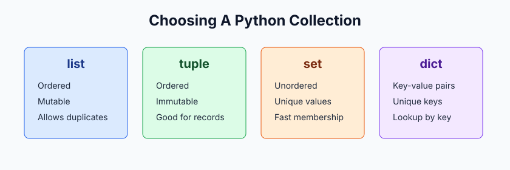

# 02. Data Structures

Data structures help us keep related values together. Python gives us several built-in collections, and each one is useful for a different kind of problem.

## Lessons

| Lesson | Folder | Use it when you need |
| --- | --- | --- |
| 1 | [01-list](01-list/README.md) | An ordered, changeable sequence |
| 2 | [02-tuples](02-tuples/README.md) | An ordered sequence that should not change |
| 3 | [03-set](03-set/README.md) | Unique values and fast membership checks |
| 4 | [04-dictionaries](04-dictionaries/README.md) | A mapping from keys to values |

## Iterable Vs Sequence

An **iterable** is any object Python can loop over one item at a time. Lists, tuples, strings, dictionaries, sets, files, and generators are iterable.

A **sequence** is an iterable with order and indexing. Lists, tuples, and strings are sequences because you can use positions such as `items[0]` or slices such as `items[1:3]`.

## Objects

Everything in Python is an object. Each object has:

- data, such as the values inside a list
- operations, such as indexing or comparison
- methods, such as `append`, `split`, or `items`

## Quick Choice Guide

- Use a `list` when order matters and values may change.
- Use a `tuple` when order matters and the group should stay fixed.
- Use a `set` when duplicates should be removed.
- Use a `dict` when each value has a label or key.
