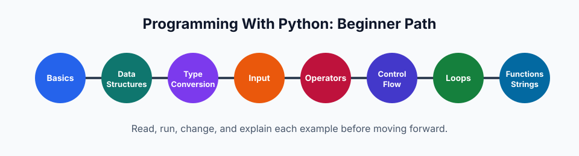

# Programming With Python

This repository is a beginner-friendly Python course directory. It is organized like a small university course pack: each topic has a short explanation, runnable examples, and practice problems where they fit.

It is not an official MIT repository, but the structure is meant to feel clear, rigorous, and easy for new students to follow.



## How To Use This Repository

1. Start with `01-basics` and move in order.
2. Read the `README.md` in each topic folder before running the `.py` files.
3. Run examples from the repository root:

```bash
python3 01-basics/01-variables/variables.py
```

4. Change one line at a time, run the file again, and observe what changed.
5. Use the practice folders after you understand the examples.

## Course Directory

| Order | Topic | Start here | What you learn |
| --- | --- | --- | --- |
| 01 | Basics | [01-basics](01-basics/README.md) | Variables, identifiers, basic types, and object references |
| 02 | Data structures | [02-data-structures](02-data-structures/README.md) | Lists, tuples, sets, dictionaries, indexing, mutation, and methods |
| 03 | Type conversion | [03-type-conversion](03-type-conversion/README.md) | Implicit and explicit conversion between types |
| 04 | Input | [04-input-function](04-input-function/README.md) | Reading user input and converting it to useful types |
| 05 | Operators | [05-operators](05-operators/README.md) | Arithmetic, logical, identity, membership, and bitwise operators |
| 06 | Control flow | [06-control-flow](06-control-flow/README.md) | `if`, `else`, `elif`, and decision-making |
| 07 | Loops | [07-loops](07-loops/README.md) | `while`, `for`, `range`, `break`, `continue`, nesting, and patterns |
| 08 | Functions | [08-function](08-function/README.md) | Parameters, arguments, return values, scope, and mutability |
| 09 | Strings | [09-strings](09-strings/README.md) | Indexing, slicing, formatting, methods, searching, and conversions |

## Study Habits

- Type examples by hand at least once.
- Predict the output before running a file.
- Keep examples small; small programs are easier to debug.
- Prefer meaningful names such as `total`, `age`, and `students`.
- When a program fails, read the error from the bottom line upward.

## Repository Notes

- Topic folders are numbered so students can follow a natural path.
- Duplicate list, tuple, and dictionary folders were consolidated under `02-data-structures`.
- File and folder names use lowercase words with hyphens where possible.
- Generated files such as `__pycache__` should not be committed.
